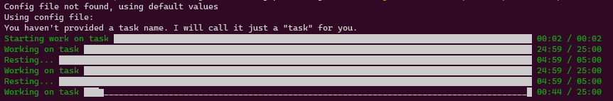

 - [last build](https://travis-ci.org/BartoszCoyote/GoPomodoro)

# GoPomodoro



Proposed stack:
- https://github.com/spf13/cobra
- https://github.com/spf13/viper

# Required dependency:

The package `alsa/asoundlib.h` is required for sound playback. It can be installed as a part of the following package:`libasound2-dev`

If `make` complains about this - install with:

`sudo apt-get install libasound2-dev`

# Configuration
By, default config file is loaded from `.GoPomodoro` in your home directory
You should format your file like this:
```
KEY=VALUE
KEY1=VALUE1
```

- SLACK_TOKEN - Slack token used in DND functionality (this has to be user oauth token starting with xoxp)
- ENABLE_SLACK_DND (true|false) - enable DND functionality
- ENABLE_WORK_CONTINUE (true|false) - enable waiting for user prompt when moving on to new work session
 
### ENABLE_ECHO_PROGRESS_TO_FILES (true|false)
This is a special command that if true will start outputing pomodoro stats and progress to files.

Time in format: `00:01 / 25:00` to file
```
/tmp/pomodoro-time
```
Stats in format:  `{"done":8,"failed":7,"rests":7}` to file
```
/tmp/pomodoro-stats
```

You can then read these form various applications.
One use-case - polybar to output timer and stats on polybar.

